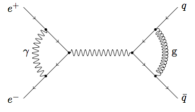

**I have just noticed that my package shares the same name as a package authored by Joshua Ellis, which is way more sophisticated and professionaly written than mine, not mentioning a well-written documentation, and the fact that it is part of a standard TeX Live distribution. To anybody who would happen to land on this page, I strongly recommend to use Joshua's package.**

## TikZ-Feynman

This is a LaTeX package providing TikZ styles and hooks to typeset Feynman diagrams with an intuitive and easy syntax. For example,

```
\begin{tikzpicture}[node distance=1cm]
\coordinate[vertex] (v1);
\coordinate[vertex, right=2cm of v1] (v2);

\coordinate[vertex, above left =of v1] (v1a);
\coordinate[vertex, below left =of v1] (v1b);
\coordinate[above left =of v1a, label=left :$e^+$] (ea);
\coordinate[below left =of v1b, label=left :$e^-$] (eb);

\coordinate[vertex, above right =of v2] (v2a);
\coordinate[vertex, below right =of v2] (v2b);
\coordinate[above right =of v2a, label=right :$q$] (fa);
\coordinate[below right =of v2b, label=right :$\bar{q}$] (fb);

\draw[fermion] (ea) -- (v1a);
\draw[fermion] (v1a) -- (v1);
\draw[fermion] (v1) -- (v1b);
\draw[fermion] (v1b) -- (eb);

\draw[fermion] (fa) -- (v2a);
\draw[fermion] (v2a) -- (v2);
\draw[fermion] (v2) -- (v2b);
\draw[fermion] (v2b) -- (fb);

\draw[photon]  (v1) -- (v2);

\draw[photon] (v1a) to[arcloop, centre=v1] node[midway, left=0.1cm]{$\gamma$} (v1b);
\draw[gluon]  (v2a) to[arcloop, centre=v2] node[midway, right=0.1cm]{g} (v2b);
\end{tikzpicture}
```

produces



It is sufficiently advanced a proof-of-concept to be useful as demonstrated by the file `tikzfeynman.tex` which showcases several other non-trivial diagrams: they should typeset exactly as `tikzfeynman.pdf`. However I need to provide some documentation since, at the moment, changing the look of photon or gluon propagators require to know the TikZ implementation and then to dig the relevant information from TikZ documentation.
